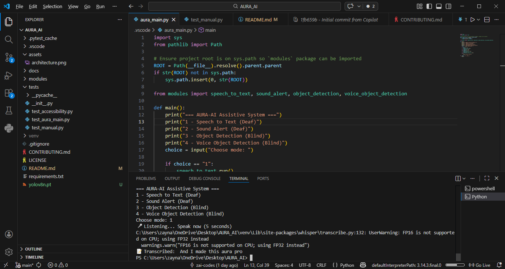
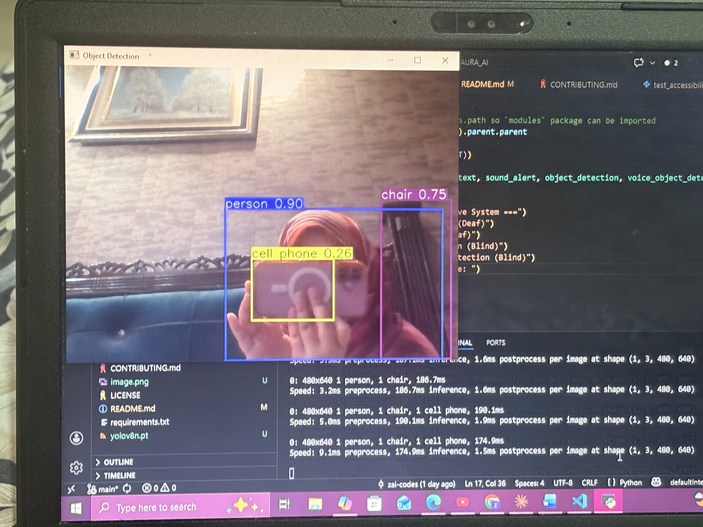

<div align="center">

# 🔮 AURA_AI

### Assistive Universal Recognition & Alert System

**An AI-powered accessibility application helping people with visual and hearing impairments interact with their environment through computer vision, speech-to-text, and intelligent audio alerts.**

(https://python.org)
(https://python.org)

</div>

---

## 📖 Overview

AURA_AI bridges the gap between the environment and individuals with sensory impairments. Using real-time object detection, voice recognition, and smart alerting — AURA_AI acts as a digital guide, empowering users to navigate their world with greater independence and confidence.

---

## ✨ Features

| Feature | Description |
|---|---|
| 🎯 **Real-Time Object Detection** | Identifies and announces surrounding objects using computer vision |
| 🎙️ **Speech-to-Text** | Converts spoken words into live on-screen captions and saved transcripts |
| 🔔 **Smart Audio Alerts** | Plays context-aware audio cues for important environmental events |
| 👁️ **Visual Transcripts** | Displays text output for hearing-impaired users in high-contrast format |
| ⌨️ **Keyboard-First Navigation** | Full functionality accessible via keyboard without requiring a mouse or touch |

---

## ♿ Accessibility Guidance

### For Blind / Low-Vision Users
- **Text-to-Speech (TTS):** The `sound_alert.py` module reads out object detections, menu options, and transcripts aloud in real time.
- **Keyboard-Only Operation:** All features in `aura_main.py` are accessible via keyboard commands — no mouse required.
- **Screen Reader Compatible:** Semantic structure is maintained throughout; compatible with standard OS screen readers.

### For Deaf / Hard-of-Hearing Users
- **Live Captions:** The `speech_to_text.py` module streams real-time captions to the display.
- **Transcript Export:** All spoken input is saved as text files for later review.
- **Visual Alerts:** High-contrast visual cues and large icons replace audio-only notifications.
- **Silent Mode:** Audio can be fully disabled — the app operates entirely on visual indicators.

---

## 🚀 Quickstart

### Prerequisites

- Python 3.8 or higher
- A working microphone (for speech-to-text features)
- A webcam (for object detection features)

### Installation

```bash
# 1. Clone the repository
git clone https://github.com/zai-codes/AURA_AI.git
cd AURA_AI

# 2. Install dependencies
pip install -r requirements.txt

# 3. Run the application
python aura_main.py
```

### Running Tests

```bash
pytest -q
```

---

## 🗂️ Project Structure

```
AURA_AI/
├── aura_main.py          # Application entry point
├── modules/
│   ├── speech_to_text.py # Microphone input & speech recognition
│   └── sound_alert.py    # Audio alerts & text-to-speech output
├── assets/               # Icons, sounds, and visual resources
├── tests/                # Unit and integration tests
├── docs/                 # Documentation and guides
├── requirements.txt      # Python dependencies
└── README.md
```

---

## 📦 Building a Distributable (Windows .exe)

For users who don't have Python installed, you can package AURA_AI as a standalone executable using PyInstaller:

```bash
pip install pyinstaller
pyinstaller --onefile aura_main.py
```

The generated `.exe` will be in the `dist/` folder. Upload it to GitHub Releases to share a direct download link.

---

## 🔒 Privacy

AURA_AI is designed with privacy in mind:
- All audio and image processing happens **locally on your device** by default.
- No data is uploaded or transmitted to external servers unless explicitly configured.
- Transcripts are saved locally and can be deleted at any time.

---

## 🤝 Contributing

Contributions are welcome! Whether it's a bug fix, new feature, or accessibility improvement — every bit helps.

1. Fork the repository
2. Create a feature branch: `git checkout -b feature/your-feature-name`
3. Commit your changes: `git commit -m "Add your feature"`
4. Push and open a Pull Request

Please read [CONTRIBUTING.md](CONTRIBUTING.md) for guidelines. When adding features, include accessibility test cases where possible.

---

## 📄 License

This project is licensed under the [MIT License](LICENSE) — free to use, modify, and distribute.

---

## 🙏 Acknowledgements

AURA_AI was built to improve quality of life for people with sensory impairments through accessible, open-source technology. Special thanks to everyone who has contributed ideas, feedback, and code.

---

<div align="center">

**Found a bug or have a feature request?**
[Open an Issue](https://github.com/zai-codes/AURA_AI/issues)

*Made with ❤️ for accessibility*

</div>